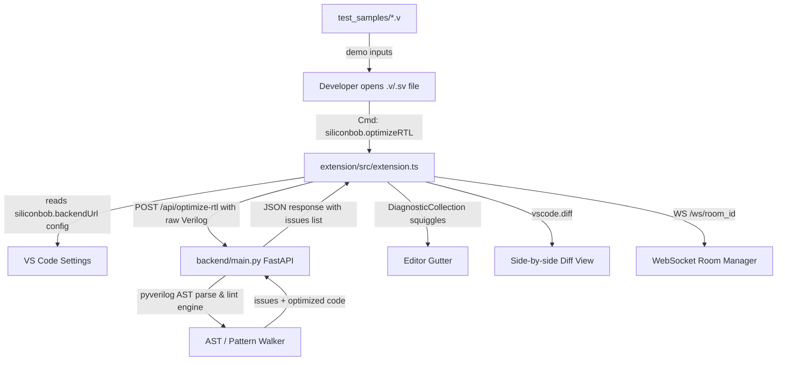

# SiliconBob (ByteSized) ⚡
### AI-Powered Electronic Chip Design & RTL Optimization Copilot for IBM Bob IDE

> **IBM Bob 2.0 48-Hour Hackathon Submission**  
> *Track: Developer Workflow Optimization (Hardware Engineering / VLSI / ASIC & FPGA)*

[](https://opensource.org/licenses/MIT)
[](https://lablab.ai)
[](https://fastapi.tiangolo.com/)
[](https://code.visualstudio.com/)

---

## 📽️ Submission Deliverables
* **Public Repository:** [https://github.com/GAGAN7350/ByteSized](https://github.com/GAGAN7350/ByteSized)
* **Demo Video:** `[LINK_TO_YOUTUBE_OR_LOOM_VIDEO]`
* **IBM Bob Session Summaries:** See [`bob_sessions/`](./bob_sessions/) directory for session logs and screenshots from team members.

---

## 🛑 Problem Statement
In electronic chip design (VLSI / ASIC / FPGA), software bugs are dangerous, but **hardware bugs are catastrophic**. 
* A single undetected flaw in Register-Transfer Level (RTL) Verilog code that slips through to silicon fabrication leads to a **chip respin costing between \$2M and \$50M** and delays time-to-market by 6 to 9 months.
* The most frequent hardware design bugs include:
  1. **Inadvertent Latches:** Incomplete `case` or `if` statements that cause synthesis tools to infer unwanted hardware latches instead of combinational logic.
  2. **Race Conditions:** Using blocking assignments (`=`) instead of non-blocking (`<=`) in clocked sequential blocks.
  3. **Non-synthesizable Code:** Leftover testbench delays (`#delay`) inside synthesizable IP cores.
  4. **Suboptimal PPA:** High dynamic power consumption and timing violations on critical paths.
* Today, hardware engineers run heavy, batch-based Electronic Design Automation (EDA) tools that take hours to report these violations. There is no instant, collaborative, in-IDE copilot for hardware engineering teams.

---

## 💡 Solution: SiliconBob
**SiliconBob** is an intelligent IDE extension and collaborative backend designed for hardware engineers working in **IBM Bob IDE** and VS Code:
1. **In-Editor Squiggle Diagnostics (`DiagnosticCollection`):** Real-time detection of latches, race conditions, and non-synthesizable constructs directly in the editor gutter.
2. **Instant Side-by-Side Diff View (`vscode.diff`):** With one click, SiliconBob automatically rewrites flawed RTL into synthesizable, race-free, and PPA-optimized hardware code.
3. **Multi-Engineer Collaboration Hub (`/ws/{room_id}`):** Allows multiple chip designers working on different SoC sub-modules (e.g., ALU, Cache Controller, Bus Interconnect) to collaborate in shared design rooms.

---

## 🏛️ System Architecture



---

## 🤖 How IBM Bob 2.0 Was Used
IBM Bob 2.0 was central to every stage of developing SiliconBob:
1. **Plan Mode:** Used to brainstorm hardware developer pain points, validate the three core design decisions, and architect the communication schema between the backend and extension (`siliconbob-plan.md`).
2. **Agent Mode:** Assisted in generating the AST-based Verilog parsing rules, the FastAPI WebSocket Room Manager, and the VS Code Extension `DiagnosticCollection` integration.
3. **Documentation & Deliverables:** Helped write sample buggy Verilog files (`test_samples/`) and structured the project for hackathon security compliance.

*Screenshots and task session logs from each team member are archived in the [`bob_sessions/`](./bob_sessions/) directory.*

---

## 🗂️ Repo Structure

```
ByteSized/
├── extensions/
│   ├── shared/            ← @bytesized/shared — local npm package, utilities for all extensions
│   ├── siliconbob-rtl/    ← Extension 1: RTL hardware copilot (IBM Bob / VS Code)
│   └── 2nd-ext/           ← Extension 2: placeholder scaffold for next team member
├── backend/
│   ├── main.py            ← App factory — mounts all routers
│   ├── shared/            ← Shared Pydantic models
│   └── routers/
│       ├── rtl/           ← SiliconBob RTL routes + engine
│       └── second_ext/    ← 2nd-ext stub routes
├── test_samples/          ← Sample .v files for testing
└── bob_sessions/          ← IBM Bob session screenshots (hackathon deliverable)
```

---

## 🚀 Quick Start Guide

### 1. Start the Backend Server
```bash
cd backend
pip install -r requirements.txt
uvicorn backend.main:app --reload --port 8000
```
*API docs available at: `http://localhost:8000/docs`*

### 2. Build the Shared Package (first time only)
```bash
cd extensions/shared
npm install
npm run compile
```

### 3. Launch the SiliconBob RTL Extension in IBM Bob IDE / VS Code
```bash
cd extensions/siliconbob-rtl
npm install
npm run compile
```
* Press **`F5`** inside IBM Bob IDE / VS Code to launch the **Extension Development Host**.
* In the host window, open any file from `test_samples/`:
  * `test_samples/alu_with_latch.v` (Tests latch inference bug)
  * `test_samples/race_condition.v` (Tests blocking race condition)
  * `test_samples/unpipelined_mult.v` (Tests PPA optimization)
* Right-click anywhere in the editor → click **"SiliconBob: Analyze & Optimize RTL"**!

---

## ➕ Adding a New Extension

Each new extension follows the same four-step pattern:

1. **Create the extension folder**
   ```bash
   cp -r extensions/2nd-ext extensions/<your-ext-name>
   ```
   Update `name`, `displayName`, and command prefixes in `extensions/<your-ext-name>/package.json`.

2. **Install the shared package**
   ```bash
   cd extensions/<your-ext-name>
   npm install        # resolves @bytesized/shared from file:../shared
   npm run compile
   ```

3. **Add your backend router**
   ```bash
   # Create backend/routers/<your_ext>/
   # Copy backend/routers/second_ext/ as a template
   ```
   Then add one line in `backend/main.py`:
   ```python
   from backend.routers.<your_ext>.router import router as your_ext_router
   app.include_router(your_ext_router)
   ```

4. **Write your feature** — add command handlers in `src/commands/`, import from `@bytesized/shared`.

---

## 👥 The Team (ByteSized)
* **Gagan** - Multi-user Sync & Backend Integration (Dev 3)
* **Technical Member 1** - Frontend & Monaco/VS Code Extension Lead (Dev 1)
* **Technical Member 2** - Hardware AI & RTL Engine Lead (Dev 2)
* **Non-Technical Member 1** - Video & Presentation Lead
* **Non-Technical Member 2** - Market Research & Business Case Lead
* **Non-Technical Member 3** - Documentation & IBM Bob Compliance Lead
